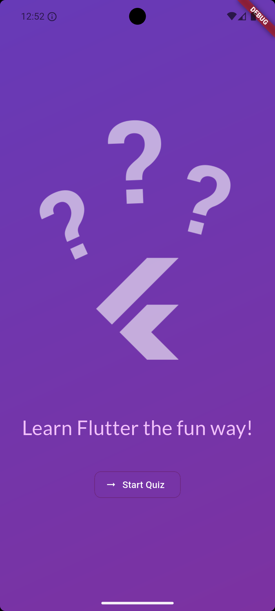
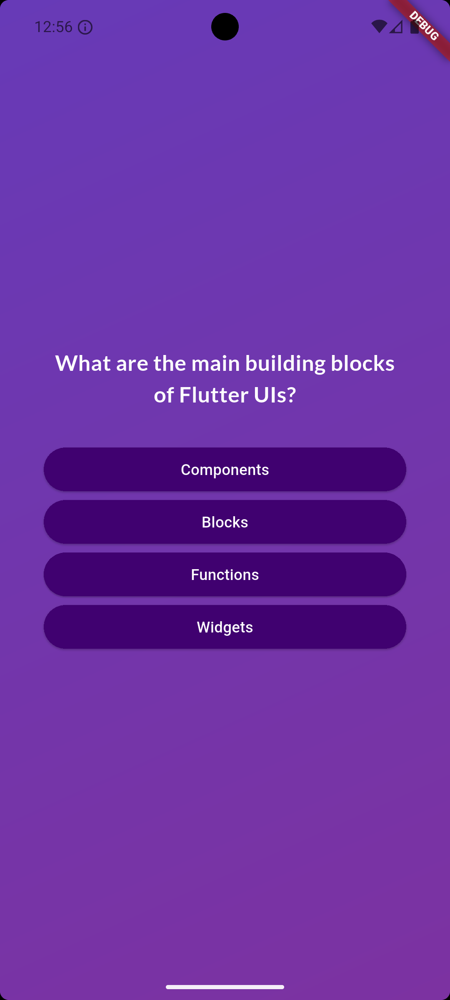
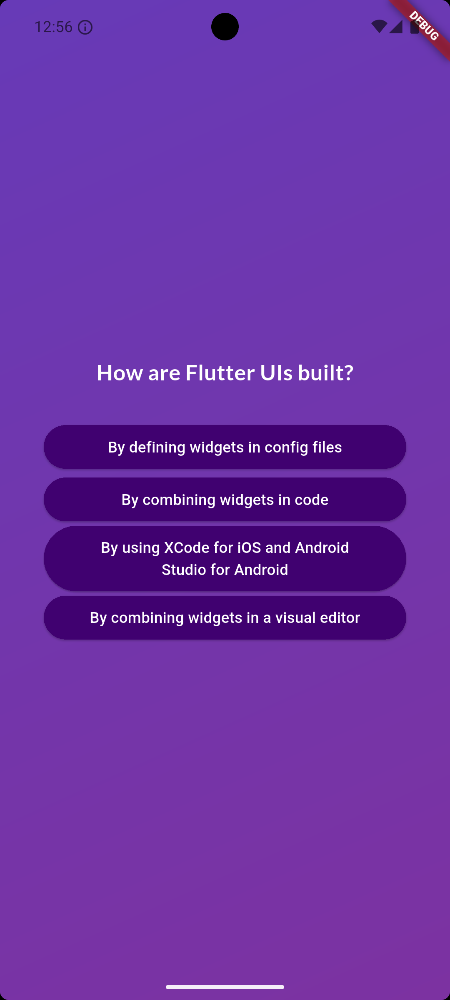
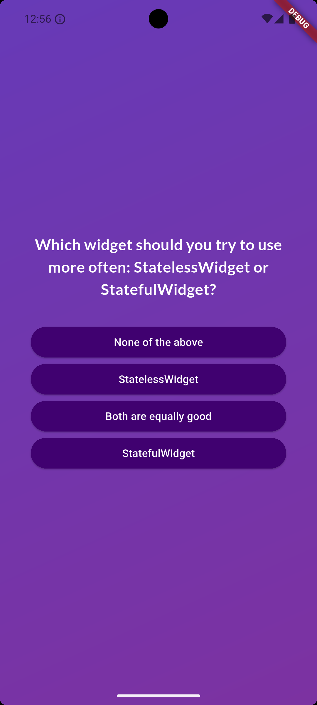
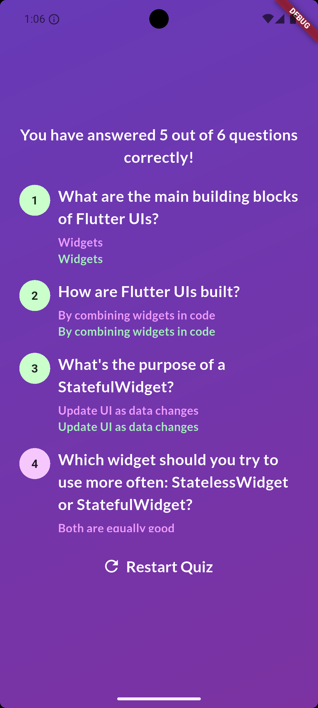

# Flutter Quiz App

A simple and very basic quiz app, where you can answer some Flutter questions and check the result of your answered questions, check how much your Flutter basics are clear.

## Table of Contents

- [Installation](#installation)
- [Features](#features)
- [Usage](#usage)

## Installation

### Prerequisites

Ensure you have the following installed:

1. Flutter SDK: Install the latest stable version from the Flutter website.
2. IDE: Android Studio or VS Code (recommended for Flutter development).
3. Git: Necessary for cloning the repository.

Ensure environment is ready

```bash
flutter doctor
```

### Installation step

1. Clone the repository

```bash
 git clone https://github.com/indexdothtml/quiz_app.git
```

2. Install dependancies

```bash
flutter pub get
```

3. Run project

```bash
flutter run
```

## Features

- Switch to Questions screen after clicking on Start Quiz button.
- Switching to different questions after selecting option.
- Shuffling options so user can't predict the correct option, everytime you take test options change its position.
- Show result screen, where how many questions are answered correctly.
- Scrollable view of all questions, with information like user selected option and correct option, also question number indicate which question was answered correctly and which one not with color indication.
- Button to restart quiz.

## Usage

1. Start your quiz by clicking on Start Quiz button.

   

2. Answer questions, by selecting one correct option.

   
   
   

3. See final result, also you can take retest by clicking on Restart Quiz button.

   
